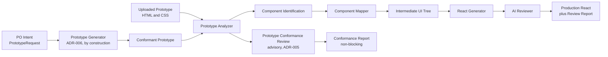
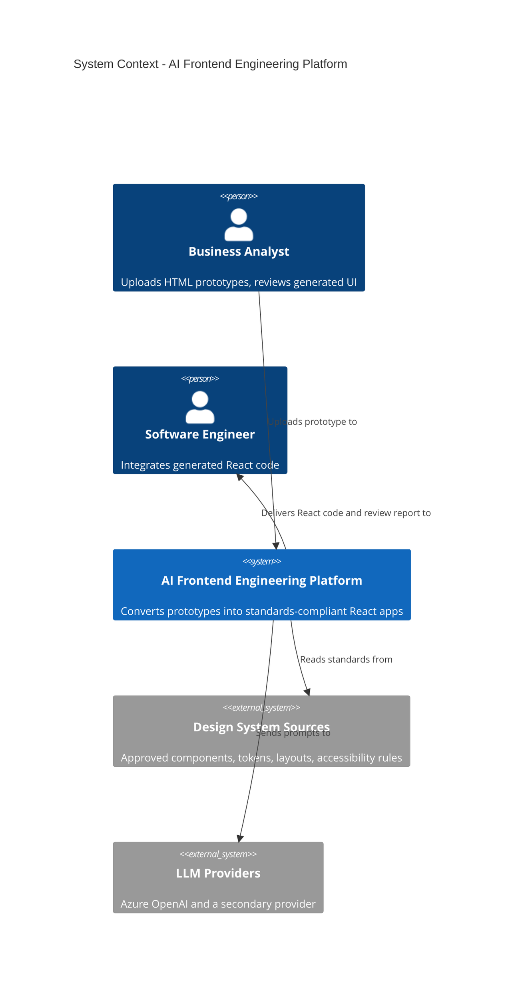
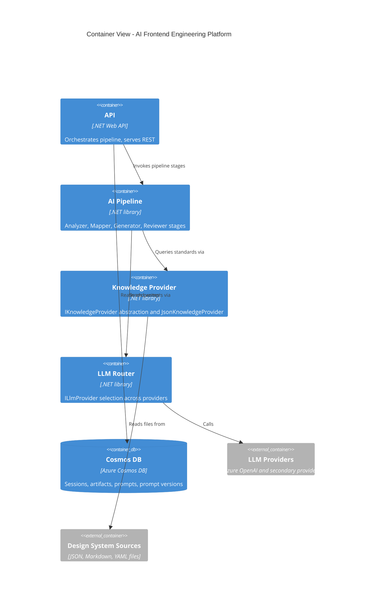
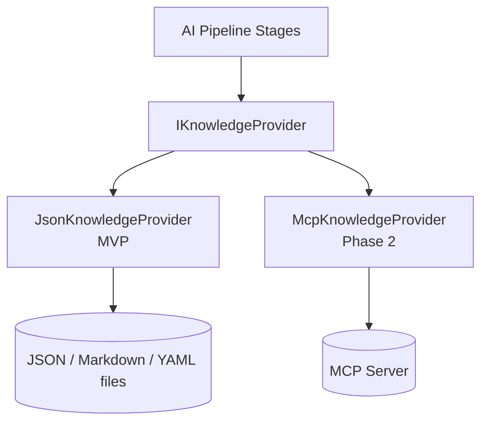

# System Architecture

Status: Approved · Date: 2026-07-07 · Version: 1.0
Vision deliverable: 1 (System Architecture)

## Summary

The platform converts HTML and CSS prototypes into production-ready React and
TypeScript applications that conform to an organization Design System by default.
A pipeline of AI stages (analyze, map, generate, review) runs on a .NET backend.
The platform also governs the *input*: a Prototype Conformance Review stage
scores the uploaded prototype against the Design System and a reference UI
baseline before conversion, so non-technical authors see drift at authoring time
(see ADR-005). For authors who cannot hand-build a conformant prototype, a
Prototype Generator produces a DS-conformant prototype from intent, correct at
once with no back-and-forth (see ADR-006, Phase 1.5). Every AI stage retrieves
Design System knowledge through a single abstraction, `IKnowledgeProvider`, so
the MVP can read local JSON, Markdown, and YAML while remaining ready to swap in
an MCP server in Phase 2 without touching AI code.

## Actors and goals

| Actor | Goal |
|---|---|
| Business Analyst | Upload a prototype and receive a conformance report plus a standards-compliant UI skeleton. |
| Product Owner | Describe intent and receive a DS-conformant prototype; validate the generated UI matches intent and design standards. |
| UX Designer | Confirm design tokens, layouts, and components are respected. |
| Software Engineer | Receive production-ready React code and a compliance review report. |

## Generation pipeline

Each stage has a typed input and output contract (defined in the schemas and AI
module documents). Stages are independent and individually testable.

## System context

Audience: business stakeholders. Shows what the system does and who and what it
connects to, with no internals.

## Container view

Audience: developers. Shows the deployment units and the boundary that enforces
the MCP-ready principle: AI stages depend on `IKnowledgeProvider`, never on
knowledge sources directly.

## Layering and the dependency rule

The backend follows Clean Architecture. Dependencies point inward toward the
domain. The domain depends on nothing. Infrastructure, AI, and knowledge
implementations depend on domain and application abstractions; the API depends on
all.

| Layer | Responsibility | Depends on |
|---|---|---|
| Domain | Entities, value objects, domain events. | Nothing. |
| Application | Pipeline orchestration, stage contracts, prompt assembly. | Domain. |
| AI | Prototype Analyzer, Component Mapper, React Generator, AI Reviewer. | Application, Knowledge, Router abstractions. |
| Knowledge | `IKnowledgeProvider` and `JsonKnowledgeProvider`. | Application (contract). |
| Infrastructure | Cosmos DB repositories, LLM provider clients, file storage. | Application, Domain. |
| API | REST endpoints, authentication, request validation. | Application, AI, Knowledge, Infrastructure. |

## MCP-ready abstraction

The core architectural principle is that AI stages never read knowledge sources
directly. All access goes through `IKnowledgeProvider`. The MVP ships
`JsonKnowledgeProvider`; Phase 2 ships `McpKnowledgeProvider` against the same
contract, so AI code does not change.

## What is not shown

- Internal class structure: see `03-diagrams/01-class-diagrams.md`.
- Request and response contracts: see `01-schemas-contracts/04-api-design.md`.
- Request sequences between stages: see `03-diagrams/02-sequence-diagrams.md`.
- Deployment topology: see `04-cross-cutting/02-deployment-architecture.md`.

## Related decisions

- `adrs/ADR-001-backend-stack-dotnet-clean-arch.md`
- `adrs/ADR-003-knowledge-provider-abstraction-mvp.md`
