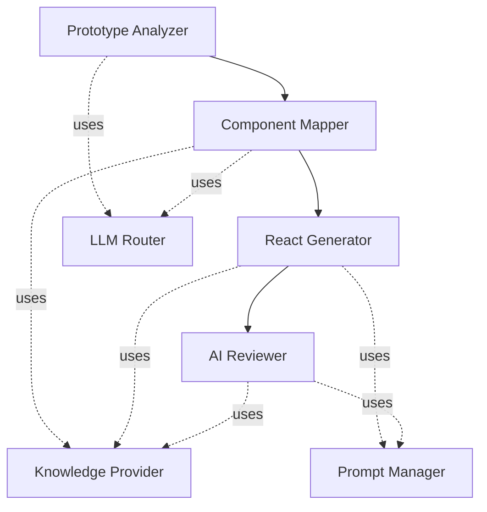

# Module Breakdown

Status: Draft · Date: 2026-07-07 · Version: 0.1
Vision deliverable: 2 (Module Breakdown)

## Summary

The platform has nine AI modules (listed in the vision) and four platform
modules that host them. Each module has a single responsibility, typed inputs and
outputs, and explicit dependencies. This breakdown is the backbone referenced by
the architecture, schema, and AI module design documents.

## AI modules

| Module | Responsibility | Inputs | Outputs | Depends on |
|---|---|---|---|---|
| Prototype Analyzer | Detect layout regions and UI primitives in a prototype. | Prototype (HTML, CSS). | `PrototypeAnalysis` with `DetectedElement` list. | LLM Router. |
| Component Mapper | Map detected elements to approved Design System components. | `PrototypeAnalysis`, knowledge query results. | `ComponentMapping` list with confidence. | Knowledge Provider, LLM Router. |
| Prompt Manager | Assemble prompts from templates, variables, and version metadata. | Stage key, variables, target prompt version. | Assembled prompt string plus metadata. | Prompt Version Manager. |
| React Generator | Produce React and TypeScript from the Intermediate UI Tree. | `IntermediateUiTree`, knowledge query results. | `GeneratedArtifact` set (files). | Knowledge Provider, LLM Router, Prompt Manager. |
| AI Reviewer | Score generated output for compliance, accessibility, and architecture. | `GeneratedArtifact` set, `IntermediateUiTree`, knowledge query results. | `ReviewReport` with score, violations, suggestions. | Knowledge Provider, LLM Router, Prompt Manager. |
| Knowledge Provider | Expose Design System knowledge through `IKnowledgeProvider`. | Knowledge queries (component, token, layout, icon, best practice, accessibility). | Knowledge entries. | Underlying source (files in MVP, MCP server in Phase 2). |
| Prompt Version Manager | Store, version, and resolve prompt templates. | Template key, version selector. | `PromptTemplate` and `PromptVersion`. | Cosmos DB (prompt store). |
| AI Provider | Implement `ILlmProvider` for one LLM backend. | Prompt, model config, parameters. | Completion response with usage metadata. | Provider client SDK. |
| LLM Router | Select an `ILlmProvider` per request by capability, cost, and policy. | Prompt, stage context, routing policy. | Provider response. | Registered `ILlmProvider` implementations. |

## Platform modules

| Module | Responsibility | Inputs | Outputs | Depends on |
|---|---|---|---|---|
| Prototype Ingestion | Accept uploaded HTML and CSS, validate, and persist. | Upload request. | Stored `Prototype`. | Infrastructure (storage, Cosmos). |
| Generation Session Manager | Track one end-to-end pipeline run and its stage states. | Session create and stage events. | `GenerationSession` state. | AI modules, Cosmos. |
| Artifact Store | Persist generated files and review reports per session. | `GeneratedArtifact` set, `ReviewReport`. | Stored artifacts with references. | Infrastructure (storage, Cosmos). |
| Identity and Access | Authenticate callers and authorize pipeline operations. | Credential or token. | Principal with roles. | Entra ID (future). |

## Module boundaries

- AI stages communicate through typed contracts defined in the domain and
  application layers, never through raw LLM output strings.
- The LLM Router is the only component that calls `ILlmProvider`. AI stages call
  the router.
- The Knowledge Provider is the only component that reads Design System sources.
  AI stages and the mapper call `IKnowledgeProvider`.
- Prompt Manager is the only component that resolves prompt versions. AI stages
  call Prompt Manager, never the store directly.

## Pipeline stage ordering

The MVP runs stages sequentially within a session. Future phases may parallelize
independent branches (for example, reviewing accessibility and architecture
concurrently).

## What is not shown

- Contract shapes for each input and output: see the schemas in
  `01-schemas-contracts/`.
- Prompt assembly and versioning detail: see `02-ai-modules/`.
- Class-level structure: see `03-diagrams/01-class-diagrams.md`.
