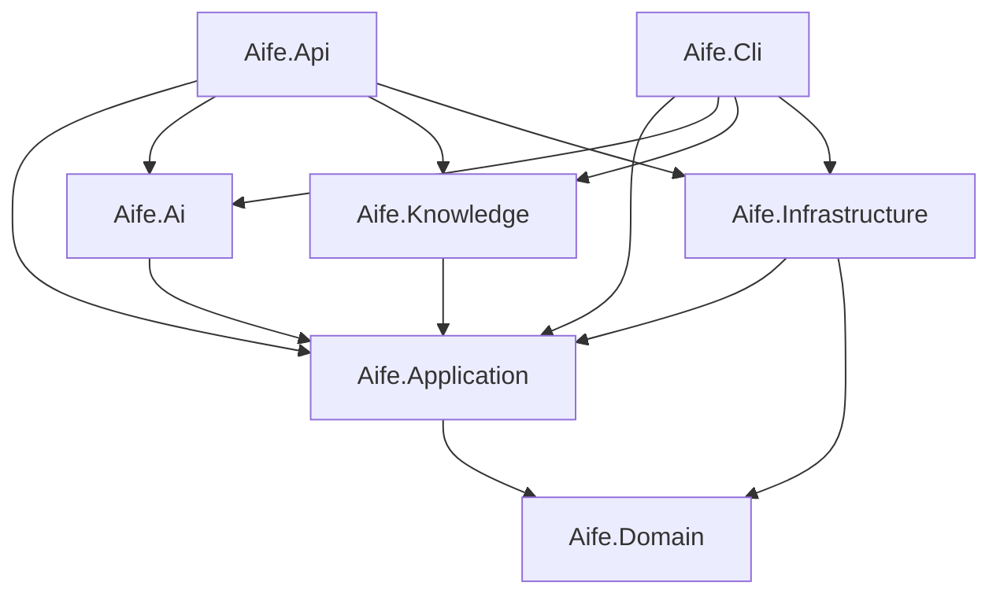

# Folder Structure

Status: Draft · Date: 2026-07-07 · Version: 0.1
Vision deliverable: 3 (Folder Structure)

## Summary

The solution `Aife.sln` follows Clean Architecture with one class per file.
Separate projects for AI stages and knowledge providers enforce the boundary
that AI code depends on `IKnowledgeProvider` and `ILlmProvider` abstractions, not
on their implementations. Test projects mirror source projects one-to-one, plus
contract and prompt-evaluation projects.

## Solution layout

```text
AI_FE_ENG/
  Aife.sln
  Directory.Build.props
  Directory.Packages.props
  README.md
  Docs/                         design documentation (this set)
  knowledge/                    sample knowledge base read by JsonKnowledgeProvider
    components/
    tokens/
    layouts/
    referenceUiPatterns/
    icons/
    best-practices/
    accessibility/
  src/
    Aife.Domain/                entities, value objects, domain events
    Aife.Application/           pipeline orchestration, stage contracts, abstractions
    Aife.Ai/                    Prototype Analyzer, Prototype Conformance Reviewer, Prototype Generator, Component Mapper, React Generator, AI Reviewer
    Aife.Knowledge/             IKnowledgeProvider, JsonKnowledgeProvider
    Aife.Infrastructure/        MVP file/in-memory repositories; post-MVP Cosmos repositories. LLM provider clients, file storage
    Aife.Api/                   REST API, authentication, validation
    Aife.Cli/                   minimal CLI for MVP runs
  tests/
    Aife.Domain.Tests/
    Aife.Application.Tests/
    Aife.Ai.Tests/
    Aife.Knowledge.Tests/
    Aife.Infrastructure.Tests/
    Aife.Api.Tests/
    Aife.Contracts.Tests/       JSON Schema validation, golden-file tests
    Aife.PromptEval/            prompt evaluation harness
```

## Project dependencies

Dependencies point inward. The domain depends on nothing. Implementations depend
on abstractions defined in `Aife.Application`.



## Where each concern lives

| Concern | Project | Notes |
|---|---|---|
| Entities and value objects | `Aife.Domain` | One class per file. No external dependencies. |
| Stage interfaces, pipeline orchestration | `Aife.Application` | Defines `IKnowledgeProvider`, `ILlmProvider`, `IPromptManager`. |
| AI stage implementations | `Aife.Ai` | Depends only on application abstractions. |
| Knowledge access | `Aife.Knowledge` | `JsonKnowledgeProvider` reads `knowledge/` in MVP. |
| Cosmos repositories, LLM clients, storage | `Aife.Infrastructure` | MVP: file/in-memory repositories. Post-MVP: Cosmos repositories. Implements `ILlmProvider` clients (ADR-004 amendment). |
| REST endpoints, auth, validation | `Aife.Api` | Composition root; registers all implementations. |
| Command-line runs | `Aife.Cli` | Thin host over `Aife.Application` for MVP demos. |
| Schema and golden-file tests | `Aife.Contracts.Tests` | Validates the three JSON Schemas and sample data. |
| Prompt quality tests | `Aife.PromptEval` | Runs prompts against a scored dataset. |

## Conventions applied in this layout

- One class per file. No file holds two classes.
- JSON serialization uses Newtonsoft.Json across all projects.
- MVP repositories are file/in-memory; post-MVP Cosmos repositories filter in
  the query, never in memory (ADR-004 amendment).
- `Aife.Ai` has no project reference to `Aife.Infrastructure` or
  `Aife.Knowledge`. It consumes them through `Aife.Application` abstractions so
  the boundary is enforced at compile time.

## What is not shown

- Class-level detail inside each project: see `03-diagrams/01-class-diagrams.md`.
- Backend layering rules and patterns: see `00-foundation/05-backend-architecture.md`.
