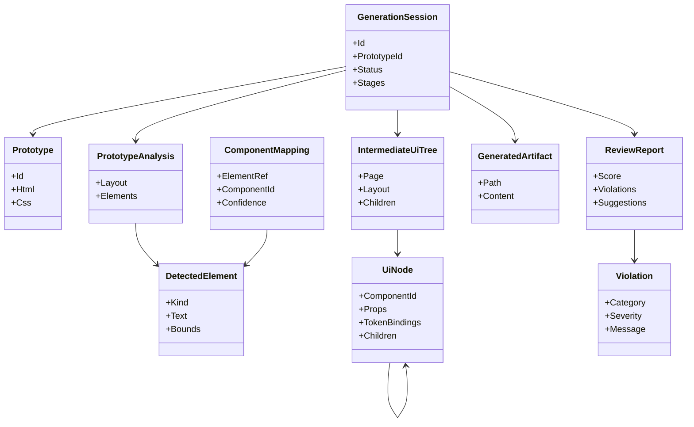
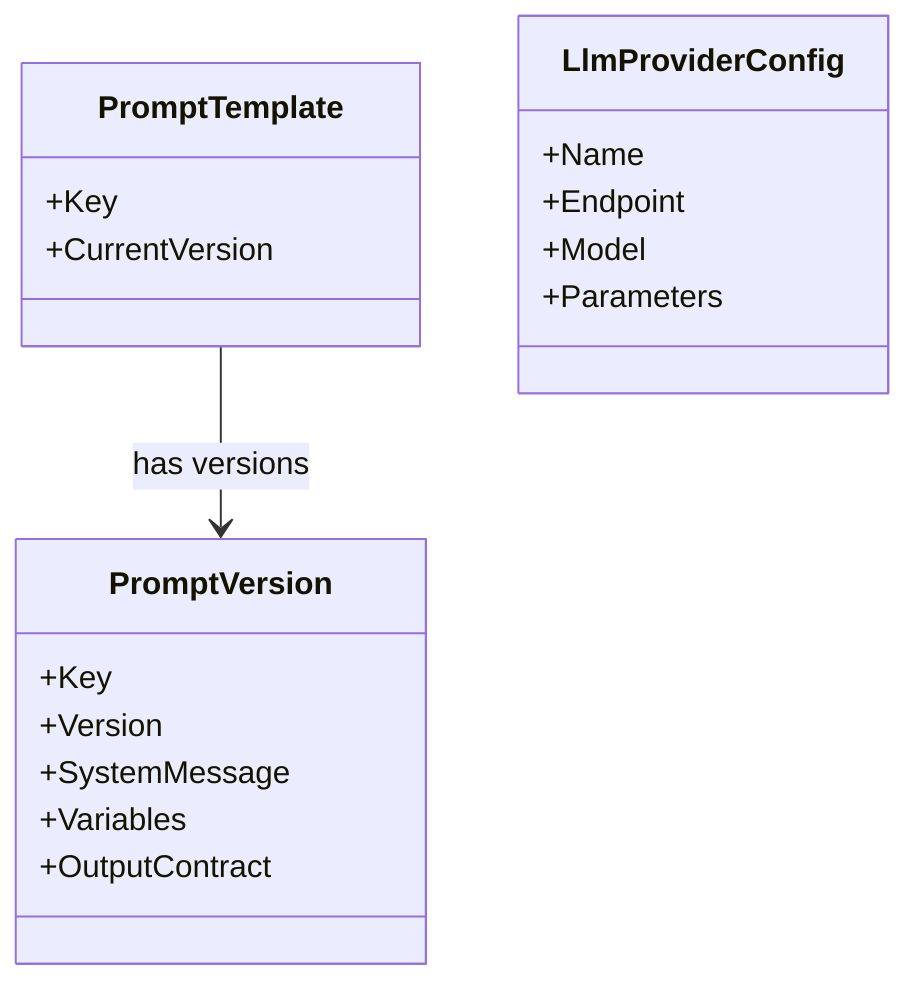

# Domain Model

Status: Draft · Date: 2026-07-07 · Version: 0.1
Vision deliverable: 8 (Domain Model)

## Summary

The domain has three bounded contexts: Generation, Knowledge, and Prompting, plus
a small Provider configuration area. Terms below are the ubiquitous language used
consistently across schemas, API contracts, and diagrams.

## Ubiquitous language

| Term | Definition |
|---|---|
| Prototype | An uploaded HTML and CSS artifact to be converted. |
| PrototypeAnalysis | Structured result of analyzing a prototype: layout and detected elements. |
| DetectedElement | A UI primitive found in a prototype (button, table, form, and so on). |
| ComponentMapping | A mapping from a detected element to an approved Design System component, with confidence. |
| IntermediateUiTree | A framework-neutral tree of UI nodes produced from mappings. |
| UiNode | One node in the intermediate tree: a component reference, props, and token bindings. |
| GeneratedArtifact | A generated React or TypeScript file. |
| ReviewReport | The AI Reviewer output: score, violations, suggestions. |
| Violation | A single compliance, accessibility, or architecture finding. |
| KnowledgeEntry | One unit of Design System knowledge (component, token, layout, icon, best practice, accessibility rule). |
| PromptTemplate | A versioned prompt with variables and an output contract. |
| PromptVersion | An immutable, semver-tagged snapshot of a prompt template. |
| LlmProviderConfig | Configuration for one LLM provider: endpoint, model, parameters. |
| GenerationSession | One end-to-end pipeline run and its stage states. |

## Generation context

## Prompting and provider context

## Invariants

- A `GenerationSession` references exactly one `Prototype` and produces at most
  one `IntermediateUiTree`, one set of `GeneratedArtifact`, and one
  `ReviewReport`.
- A `ComponentMapping` with confidence below the threshold is flagged for
  human review rather than auto-applied.
- A `UiNode` references a component id that must exist as a `KnowledgeEntry`.
- A `PromptVersion` is immutable once published; edits create a new version.

## What is not shown

- Serialization shapes of these entities: see the schemas in
  `01-schemas-contracts/`.
- Implementation class structure: see `03-diagrams/01-class-diagrams.md`.
