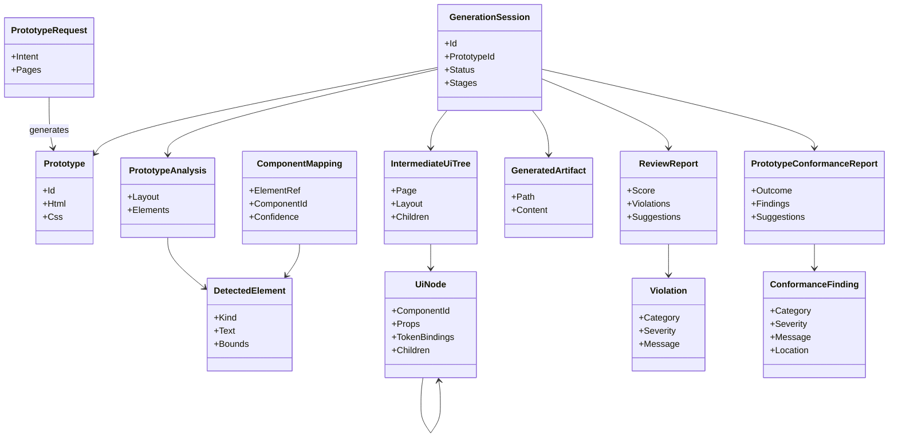
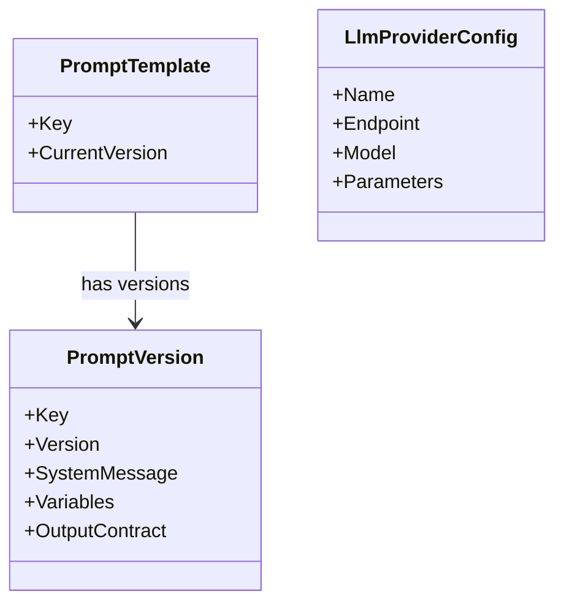

# Domain Model

Status: Approved · Date: 2026-07-07 · Version: 1.0
Vision deliverable: 8 (Domain Model)

## Summary

The domain has three bounded contexts: Generation, Knowledge, and Prompting, plus
a small Provider configuration area. Terms below are the ubiquitous language used
consistently across schemas, API contracts, and diagrams.

## Ubiquitous language

| Term | Definition |
|---|---|
| Prototype | An HTML and CSS artifact to be converted; uploaded by an author or generated from intent (ADR-006). |
| PrototypeRequest | An intent spec (pages, regions, components, content) used by the Prototype Generator to produce a conformant Prototype. |
| PrototypeAnalysis | Structured result of analyzing a prototype: layout and detected elements. |
| DetectedElement | A UI primitive found in a prototype (button, table, form, and so on). |
| ComponentMapping | A mapping from a detected element to an approved Design System component, with confidence. A null `ComponentId` with confidence 0 means no KB match exists. |
| IntermediateUiTree | A framework-neutral tree of UI nodes produced from mappings. Only auto-applied mappings (confidence ≥ 0.5, non-null ComponentId) appear in the tree. |
| UiNode | One node in the intermediate tree: a component reference, props, and token bindings. |
| GeneratedArtifact | A generated React or TypeScript file. |
| ReviewReport | The AI Reviewer output: score, violations, suggestions. |
| Violation | A single compliance, accessibility, or architecture finding. |
| PrototypeConformanceReport | The Prototype Conformance Reviewer output: drift findings against the Design System and reference UI (ADR-005). |
| ConformanceFinding | A single drift finding in a conformance report: category, severity, message, location. |
| KnowledgeEntry | One unit of Design System knowledge (component, token, layout, icon, best practice, accessibility rule, reference UI pattern). |
| PromptTemplate | A versioned prompt with variables and an output contract. |
| PromptVersion | An immutable, semver-tagged snapshot of a prompt template. |
| LlmProviderConfig | Configuration for one LLM provider: endpoint, model, parameters. |
| GenerationSession | One end-to-end pipeline run and its stage states. |

## Generation context

## Prompting and provider context

## Invariants

- A `GenerationSession` references exactly one `Prototype` and produces at most
  one `IntermediateUiTree`, one set of `GeneratedArtifact`, one `ReviewReport`,
  and one `PrototypeConformanceReport`.
- A `Prototype` may be uploaded by an author or generated from a
  `PrototypeRequest`. A generated prototype is conformant by construction
  (ADR-006); an uploaded prototype is scored by the Prototype Conformance Review.
- A `PrototypeConformanceReport` is advisory for uploaded prototypes and a
  non-blocking sanity check for generated ones (ADR-005).
- A `ComponentMapping` with confidence below the threshold is flagged for
  human review rather than auto-applied.
- A `UiNode` references a component id that must exist as a `KnowledgeEntry`.
- A `PromptVersion` is immutable once published; edits create a new version.
- Persistence goes through repository interfaces in the application layer. The
  MVP uses file/in-memory implementations; Cosmos is the post-MVP target
  (ADR-004 amendment).

## Behavior on novel/unmapped elements

When a prototype contains HTML elements with no `mapsFromHtml` match in the
Knowledge Base (for example, `<carousel>`, `<timeline>`, or any custom element
not recognized by any approved component):

| Flow | Behavior | PO experience |
|---|---|---|
| Upload (PO authors HTML) | Unmapped elements get `componentId = null, confidence = 0.0`. Conformance review produces advisory `CONF_UNMAPPED_ELEMENT` findings (non-blocking). Assembler skips them; React output is partial. | PO receives incomplete React — recognized components only. Conformance report lists what was skipped. |
| Generate from intent (PO describes UI) | If the `PrototypeRequest` references an unknown `componentId`, the generator throws an `InvalidOperationException` before the LLM call. | PO receives an immediate error: "Component 'X' is not approved or not found." Must fix the request and retry. |

The platform never invents components. Every element must have a Knowledge Base
entry before it can appear in generated output. See the component mapping
strategy for details.

## What is not shown

- Serialization shapes of these entities: see the schemas in
  `01-schemas-contracts/`.
- Implementation class structure: see `03-diagrams/01-class-diagrams.md`.
