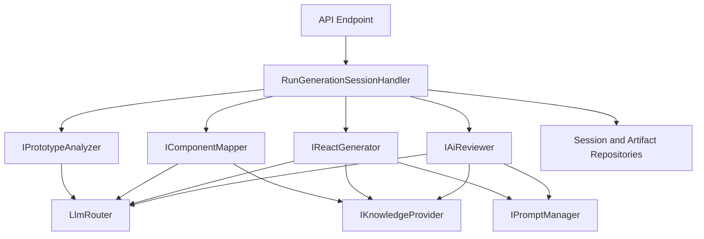

# Backend Architecture

Status: Approved · Date: 2026-07-07 · Version: 1.0
Vision deliverable: 4 (Backend Architecture)

## Summary

The backend is a .NET Web API that orchestrates the generation pipeline through
application-layer commands. Dependencies point inward to the domain. AI stages
and knowledge access are consumed through abstractions, so the API is a
composition root that wires implementations. Long-running generation runs
asynchronously with status polling (SignalR optional for later).

## Layering and the dependency rule

The dependency rule is enforced by project references (see
`03-folder-structure.md`). The domain depends on nothing. The application layer
defines abstractions (`IKnowledgeProvider`, `ILlmProvider`, `LlmRouter`,
`IPromptManager`, stage interfaces). Infrastructure and knowledge implement those
abstractions. The API is the only composition root.

| Layer | Pattern | Notes |
|---|---|---|
| Domain | Plain entities and value objects | One class per file. No attributes that tie to infrastructure. |
| Application | Command and query handlers, stage contracts | MediatR for request dispatch. FluentValidation for input. |
| AI | Stage implementations | Implement stage interfaces from application. Call `LlmRouter` and `IKnowledgeProvider` only. |
| Knowledge | `JsonKnowledgeProvider` | Reads `knowledge/`. Implements `IKnowledgeProvider`. |
| Infrastructure | Repositories, LLM clients, storage | MVP: file/in-memory repositories behind application-layer interfaces. Post-MVP: Cosmos repositories with query-side filtering. Polly resilience for LLM calls. |
| API | Minimal controllers or endpoints | Registers all implementations. Returns `ProblemDetails` on errors. |

## Pipeline orchestration

A generation session is driven by a `RunGenerationSessionHandler` in the
application layer. It executes stages in order, persists each stage result, and
updates session status. Stages are addressed by interface, not by concrete class,
so they can be replaced or reordered for tests.

## Request handling

- Input validation uses FluentValidation at the API boundary. Invalid requests
  return 400 with validation details.
- Errors are returned as RFC 7807 `ProblemDetails`. Unhandled exceptions are
  logged with a correlation id and surfaced as 500 without stack traces.
- LLM and Cosmos calls use Polly policies for transient faults: retry with
  exponential backoff and a circuit breaker, tuned per provider.

## JSON serialization

All JSON serialization uses Newtonsoft.Json (`JsonConvert`), configured once in
the API setup. Use `CamelCasePropertyNamesContractResolver` for API responses.
Do not introduce `System.Text.Json` in this codebase. Stage outputs that cross
the LLM boundary are deserialized into typed contracts, never used as raw
strings.

## Repositories

Repositories implement query interfaces defined in the application layer:
`ISessionRepository`, `IArtifactRepository`, `IPromptRepository`,
`IPromptVersionRepository`. The API composition root wires the active
implementation, so the persistence backend is swappable without touching the
domain or application layers.

### MVP: file and in-memory repositories

Per the ADR-004 MVP-scope amendment, the MVP ships file-based implementations
that require no cloud resources, mirroring the `JsonKnowledgeProvider` pattern
from ADR-003: `FileSessionRepository`, `FileArtifactRepository`,
`FilePromptRepository`, `FilePromptVersionRepository` persist JSON files on
disk. The `knowledgeCache` store is omitted in the MVP.

### Post-MVP: Cosmos DB repositories

`CosmosDb*Repository` implementations are the production target once Cosmos is
provisioned. Every read filters in the Cosmos query using parameters and
partition keys; no repository pulls a large document set and filters in memory.
Write operations upsert by id and partition key. Partition keys per container
are specified in `01-schemas-contracts/05-database-design.md`.

## Asynchronous generation

Generation can exceed typical HTTP timeouts. The create-session endpoint returns
immediately with a session id and a `202 Accepted` plus a status URL. Clients
poll `GET /sessions/{id}` for stage progress. An optional SignalR hub may stream
stage events in a later phase. Artifacts and the review report are retrievable
once the session reaches a terminal state.

## Observability

Structured logging via Serilog with a correlation id per session. OpenTelemetry
traces span each stage and each LLM call. Metrics track stage duration, LLM token
usage, and router provider selection. Details are covered in
`04-cross-cutting/06-scalability-strategy.md`.

## What is not shown

- API endpoint contracts: see `01-schemas-contracts/04-api-design.md`.
- Cosmos container and partition design: see `01-schemas-contracts/05-database-design.md`.
- Class structure: see `03-diagrams/01-class-diagrams.md`.
