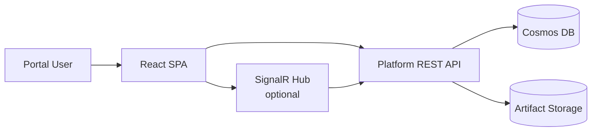

# Frontend Architecture

Status: Approved · Date: 2026-07-07 · Version: 1.0
Vision deliverable: 5 (Frontend Architecture)

## Summary

The Phase 1 MVP is API-first. The client surface is a REST API plus a minimal
command-line host for runs and demos. A web portal is deferred to a later phase
and is described here as design only. This keeps the MVP focused on pipeline
correctness and avoids building UI before the generation contract is stable.

This scope is the recommended answer to open question one (platform UI scope) in
the plan. Confirm before committing: API and CLI only, minimal portal later, or
portal only.

## MVP client surface

| Client | Purpose | Status |
|---|---|---|
| REST API | Primary integration surface for all pipeline operations. | In scope for MVP design. |
| `Aife.Cli` | Run a session end to end from the command line; useful for demos and tests. | In scope for MVP design. |
| Web portal | Upload prototypes, watch session progress, review output. | Deferred (design below). |

## Deferred web portal design

The portal, when built, will be a React and TypeScript single-page application.
It dogfoods the platform's own output conventions: it uses approved components,
design tokens, and approved layouts. It is consumed by all four actor types.

Portal views (future):

| View | Audience | Purpose |
|---|---|---|
| Prototype upload | BA, UX | Upload HTML and CSS, start a session. |
| Session dashboard | All | Watch stage progress and status. |
| Review report | PO, Engineer | Read compliance score, violations, suggestions. |
| Artifact browser | Engineer | Browse and download generated React files. |
| Diff view | Engineer | Compare generated output across prompt versions or sessions. |

## Technology choices for the portal (when built)

- React with TypeScript, built with Vite.
- Approved Design System components and tokens only (dogfooding).
- State management sized to the view; no global store unless a view needs it.
- Authentication via Entra ID, same identity as the API.

## Why the portal is deferred

- The generation contract (schemas, stage outputs) is still being designed in
  this milestone. Building UI against an unstable contract produces rework.
- The CLI exercises the full pipeline for demos and tests without UI investment.
- Portal effort is better spent once the pipeline produces reliable,
  review-ready output.

## Open question

Open question one: confirm the MVP is API and CLI only with the portal deferred.
The alternative is a minimal portal in the MVP. Recommendation: API and CLI only.

## What is not shown

- API endpoint contracts: see `01-schemas-contracts/04-api-design.md`.
- Auth and security: see `04-cross-cutting/04-security.md`.
