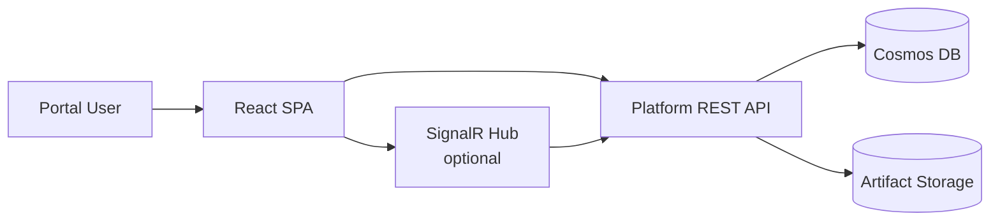

# Frontend Architecture

Status: Approved · Date: 2026-07-07 · Version: 1.0
Vision deliverable: 5 (Frontend Architecture)

## Summary

The Phase 1 MVP is API-first. The primary client surface is a REST API plus a
minimal command-line host for runs and demos. A lightweight stakeholder dashboard
(ADR-007) is included in the MVP as a static page served by the API for business
stakeholder demos and evaluation. The full web portal remains deferred to a later
phase and is described here as design only.

This scope is the confirmed answer to open question one (platform UI scope):
API, CLI, and a lightweight dashboard in the MVP; full portal later.

## MVP client surface

| Client | Purpose | Status |
|---|---|---|
| REST API | Primary integration surface for all pipeline operations. | In scope for MVP. |
| `Aife.Cli` | Run a session end to end from the command line; useful for demos and tests. | In scope for MVP. |
| Stakeholder dashboard | Upload prototypes, view generated React live, read review report, download PDF. Served as static files by the API (ADR-007). | In scope for MVP (ADR-007, added 2026-07-10). |
| Web portal | Full SPA with auth, SignalR, dogfooded DS components. | Deferred (design below). |

## Deferred web portal design

The portal, when built, will be a React and TypeScript single-page application.
It dogfoods the platform's own output conventions: it uses approved components,
design tokens, and approved layouts. It is consumed by all four actor types.

Portal views (future):

| View | Audience | Purpose |
|---|---|---|
| Prototype upload | BA, UX | Upload HTML and CSS, start a session. |
| Session dashboard | All | Watch stage progress and status. |
| Review report | PO, Engineer | Read compliance score, violations, suggestions. |
| Artifact browser | Engineer | Browse and download generated React files. |
| Diff view | Engineer | Compare generated output across prompt versions or sessions. |

## Technology choices for the portal (when built)

- React with TypeScript, built with Vite.
- Approved Design System components and tokens only (dogfooding).
- State management sized to the view; no global store unless a view needs it.
- Authentication via Entra ID, same identity as the API.

## Why the portal is deferred

- The generation contract (schemas, stage outputs) is still being designed in
  this milestone. Building UI against an unstable contract produces rework.
- The CLI exercises the full pipeline for demos and tests without UI investment.
- Portal effort is better spent once the pipeline produces reliable,
  review-ready output.

## Open question

Open question one: **resolved** (ADR-007, 2026-07-10). The MVP includes a
lightweight stakeholder dashboard (static page served by the API) alongside the
API and CLI. The full portal remains deferred.

## What is not shown

- API endpoint contracts: see `01-schemas-contracts/04-api-design.md`.
- Auth and security: see `04-cross-cutting/04-security.md`.
