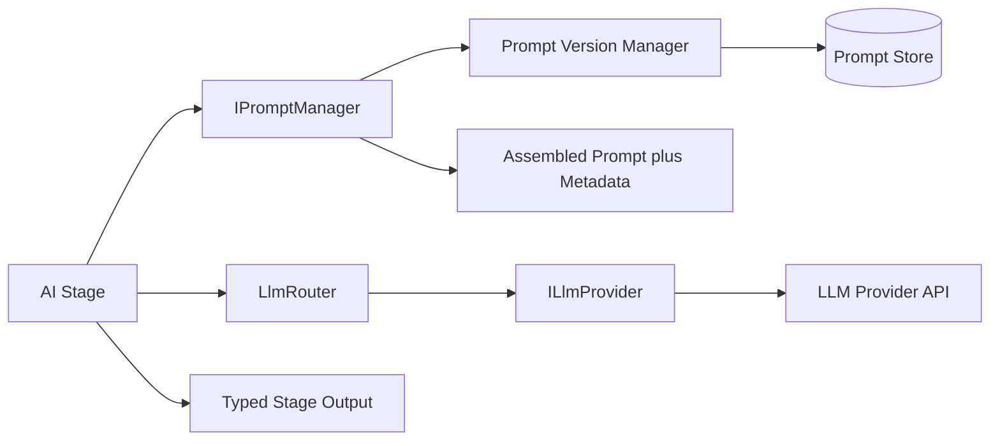

# AI Architecture

Status: Approved · Date: 2026-07-07 · Version: 1.0
Vision deliverable: 6 (AI Architecture)

## Summary

The AI pipeline is a sequence of stages with typed input and output contracts.
Each stage calls the LLM Router (never a provider directly) and the Knowledge
Provider (never a source directly), and assembles prompts through the Prompt
Manager. Stage outputs are deserialized into typed contracts, so downstream
stages never parse raw LLM strings.

## Stage contracts

| Stage | Interface | Input | Output |
|---|---|---|---|
| Prototype Analyzer | `IPrototypeAnalyzer` | `Prototype` | `PrototypeAnalysis` |
| Component Mapper | `IComponentMapper` | `PrototypeAnalysis` | `ComponentMapping` list |
| React Generator | `IReactGenerator` | `IntermediateUiTree` | `GeneratedArtifact` set |
| AI Reviewer | `IAiReviewer` | `GeneratedArtifact` set, `IntermediateUiTree` | `ReviewReport` |

The Component Identification step is part of the Prototype Analyzer output: each
`DetectedElement` carries a kind that the mapper consumes. The Intermediate UI
Tree is built from `ComponentMapping` results by an application-layer assembler
before generation, so the React Generator receives a tree, not raw mappings.

## Prompt assembly

Stages do not embed prompts. They call `IPromptManager` with a stage key and a
dictionary of variables. The Prompt Manager resolves the current `PromptVersion`
for that key, fills variables, and returns the assembled prompt plus metadata
(provider, model, version). This keeps prompts versioned and out of stage code.



## LLM Router

The router is the single entry point for LLM calls. It selects an
`ILlmProvider` for each request using a routing policy and a capability matrix.

Provider selection inputs:

- Stage context (analyzer, mapper, generator, reviewer).
- Required capabilities (context window, function calling, vision, JSON mode).
- Cost and latency policy.
- Current provider health (circuit breaker state).

| Provider | Capabilities | Default for | Notes |
|---|---|---|---|
| Azure OpenAI | Text, JSON mode, function calling, vision (some models) | Analyzer, Generator, Reviewer | Default provider. Content filtering on. |
| Secondary (pending confirmation; recommended Anthropic Claude) | Text, long context, function calling | Mapper, long-context review | Fallback for cost or capacity. |

Open question two: confirm the secondary provider. Recommendation: Anthropic
Claude. Alternatives: OpenAI direct, or a third Azure-deployed model only.

## ILlmProvider contract

```
interface ILlmProvider {
    string Name
    ProviderCapabilities Capabilities
    Task<LlmResponse> CompleteAsync(LlmRequest request, CancellationToken ct)
}
```

- `LlmRequest` carries the assembled prompt, model, parameters, and an optional
  response schema for JSON mode.
- `LlmResponse` carries the completion text, parsed JSON (when a schema was
  supplied), token usage, and the provider finish reason.
- Implementations isolate provider-specific concerns: retry, token accounting,
  response shape normalization.

## AI Reviewer scoring

The reviewer produces a `ReviewReport` with an overall compliance score and
findings grouped by category. Findings carry severity (blocking or advisory).

| Category | Checks |
|---|---|
| Compliance | Approved components only, approved layouts, design tokens only. |
| Accessibility | Roles, labels, contrast, keyboard navigation. |
| Architecture | File structure, import resolution, no inline styles, no hardcoded colors. |
| Suggestions | Improvements that do not block. |

Blocking findings fail the session review; advisory findings are reported but do
not block. Scoring detail and thresholds are in `02-ai-modules/05-ai-review-strategy.md`.

## What is not shown

- Prompt template content: see `02-ai-modules/01-prompt-templates.md`.
- Mapping rules and confidence: see `02-ai-modules/03-component-mapping-strategy.md`.
- Generation rules: see `02-ai-modules/04-react-generation-strategy.md`.
- Class structure of providers and stages: see `03-diagrams/01-class-diagrams.md`.
