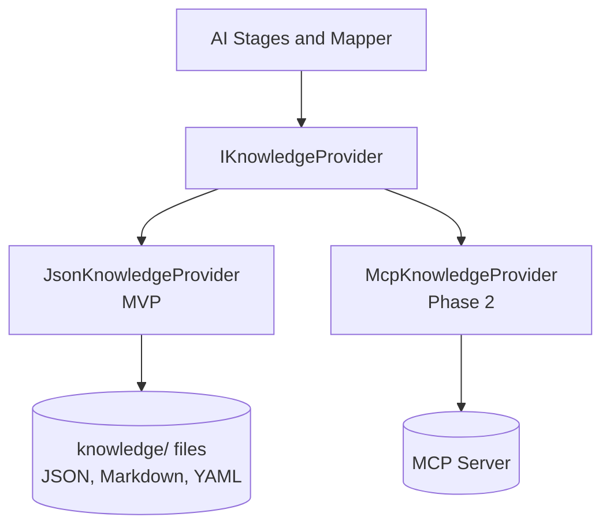
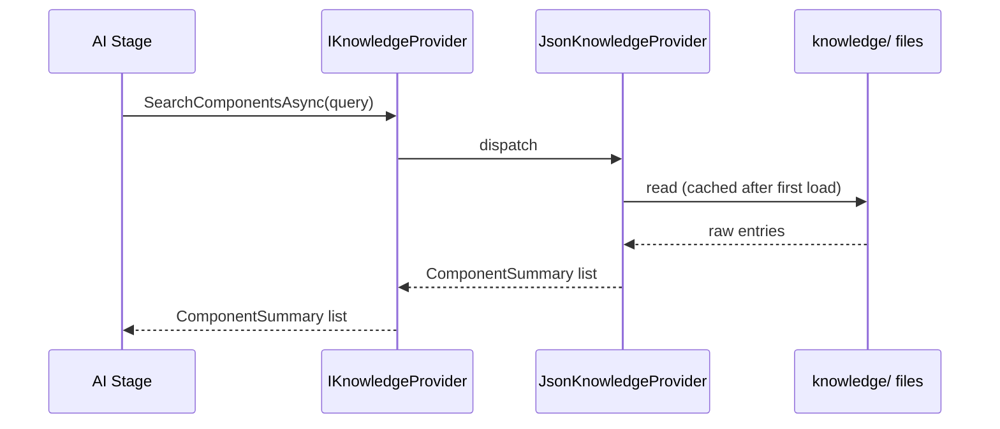

# MCP Architecture

Status: Approved · Date: 2026-07-07 · Version: 1.0
Vision deliverable: 7 (MCP Architecture)

## Summary

All Design System knowledge access goes through `IKnowledgeProvider`. The MVP
implements it with `JsonKnowledgeProvider` reading local files. Phase 2 adds
`McpKnowledgeProvider` against the same contract, so AI code is unchanged. The
method set is designed to map one-to-one onto the Phase 2 MCP tools.

## IKnowledgeProvider contract

```
interface IKnowledgeProvider {
    Task<IReadOnlyList<ComponentSummary>> SearchComponentsAsync(ComponentQuery query, CancellationToken ct)
    Task<ComponentDetail> GetComponentAsync(string componentId, CancellationToken ct)
    Task<ComponentProps> GetComponentPropsAsync(string componentId, CancellationToken ct)
    Task<IReadOnlyList<ComponentExample>> GetComponentExamplesAsync(string componentId, CancellationToken ct)
    Task<IReadOnlyList<LayoutPattern>> GetLayoutPatternsAsync(CancellationToken ct)
    Task<DesignTokenSet> GetDesignTokensAsync(CancellationToken ct)
    Task<IReadOnlyList<Icon>> GetIconsAsync(IconQuery query, CancellationToken ct)
    Task<IReadOnlyList<ComponentSummary>> SearchComponentsByDescriptionAsync(string description, CancellationToken ct)
    Task<IReadOnlyList<BestPractice>> GetBestPracticesAsync(BestPracticeQuery query, CancellationToken ct)
    Task<IReadOnlyList<AccessibilityRule>> GetAccessibilityRulesAsync(CancellationToken ct)
}
```

## Method to MCP tool mapping

Each method maps directly to a Phase 2 MCP tool, so `McpKnowledgeProvider` is a
thin client over the MCP server.

| Method | Phase 2 MCP tool |
|---|---|
| `SearchComponentsAsync` | `search_components` |
| `GetComponentAsync` | `get_component` |
| `GetComponentPropsAsync` | `get_component_props` |
| `GetComponentExamplesAsync` | `get_component_examples` |
| `GetLayoutPatternsAsync` | `get_layout_patterns` |
| `GetDesignTokensAsync` | `get_design_tokens` |
| `GetIconsAsync` | `get_icons` |
| `SearchComponentsByDescriptionAsync` | `search_components_by_description` |
| `GetBestPracticesAsync` | `get_best_practices` |
| `GetAccessibilityRulesAsync` | `get_accessibility_rules` |

## Provider implementations



`JsonKnowledgeProvider` loads the sample dataset under `knowledge/` (see
`01-schemas-contracts/03-knowledge-base-schema.md`) and answers queries from
memory after a one-time load. `McpKnowledgeProvider` forwards each call to the
MCP server over the chosen transport.

## Knowledge lookup sequence



## Contract equivalence

Both implementations return the same types defined in `Aife.Application`. The
composition root (the API) registers exactly one `IKnowledgeProvider`. Switching
from JSON to MCP is a registration change plus the MCP server existing; no AI or
mapper code changes.

## Boundary enforcement

- `Aife.Ai` references `Aife.Application` only. It has no reference to
  `Aife.Knowledge`, so stages cannot construct `JsonKnowledgeProvider` directly.
- The mapper and stages accept `IKnowledgeProvider` through constructor
  injection.
- No AI module reads files, JSON, Markdown, or YAML. This is verifiable by grep:
  no `File.Read`, `JsonConvert.DeserializeObject`, or YAML parse calls in
  `Aife.Ai`.

## What is not shown

- MCP server transport, tool schemas, and auth: see
  `04-cross-cutting/01-mcp-server-design.md`.
- Knowledge Base file layout and schema: see
  `01-schemas-contracts/03-knowledge-base-schema.md`.
