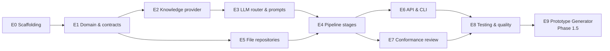

# Phase 1 MVP — Work Breakdown

Status: Approved · Date: 2026-07-07 · Version: 1.0

## Summary

Decomposes the Phase 1 MVP (Prototype → Production React pipeline) into
sprint-able epics, stories, and acceptance criteria. It executes against the
Approved v1.0 design baseline. Dates are not committed here; they are set during
sprint planning, per `04-cross-cutting/09-future-roadmap.md`. Phase 1.5 (Prototype
Generator, ADR-006) is included as a follow-on epic, not part of the core MVP.

## Scope

**In (core MVP):** Prototype upload → Analyze → Map → Intermediate UI Tree →
React Generator → AI Reviewer; file/in-memory repositories (ADR-004 amendment);
Prototype Conformance Review, advisory (ADR-005); `JsonKnowledgeProvider` with a
sample dataset including reference UI patterns; prompt management/versioning;
multi-provider LLM router; REST API; CLI; the test pyramid.

**Out (deferred):** Cosmos DB repositories (post-MVP, ADR-004); MCP server
(Phase 2); auto-normalization and blocking gates (Phase 4); Figma/image input
(Phase 2). The Prototype Generator (ADR-006) is Phase 1.5 — built right after the
core MVP, reusing the same abstractions.

## Guiding principles

- **Vertical slice first.** Deliver one end-to-end path (upload → React + review)
  with file repos before hardening any single stage.
- **TDD per the testing strategy.** Unit tests with fakes; contract tests against
  JSON Schemas; golden-file tests for generated output.
- **Abstractions are immutable.** Stages depend on `IKnowledgeProvider`,
  `LlmRouter`, `IPromptManager`, and repository interfaces only. No stage reads
  files or calls a provider directly.
- **No cloud resources.** MVP uses file/in-memory repositories; no Cosmos, no
  emulator dependency in CI.
- **Conformant by construction where we generate.** React output uses only
  approved components/tokens; the Phase 1.5 Prototype Generator extends this to
  the prototype itself.

## Epic dependency graph

## Epics

### E0 — Solution scaffolding
Set up the Clean Architecture solution so the dependency rule is enforced at
compile time. (See `00-foundation/03-folder-structure.md`.)

| Story | Task | AC |
|---|---|---|
| E0-1 | Create `Aife.sln` with projects: Domain, Application, Ai, Knowledge, Infrastructure, Api, Cli | Projects exist with correct references |
| E0-2 | Add `Directory.Build.props`, `Directory.Packages.props` (central package mgmt), Newtonsoft.Json global config | One Newtonsoft config; packages centralized |
| E0-3 | DI composition root in Api; ProblemDetails (RFC 7807); Serilog + correlation id | Errors return ProblemDetails; logs carry correlation id |
| E0-4 | Mirror test projects + CI skeleton (build + test) | `dotnet build` and `dotnet test` green; `Aife.Ai` does not reference `Aife.Knowledge`/`Aife.Infrastructure` |

### E1 — Domain & contracts
Entities, JSON Schemas, and the sample dataset that every later epic consumes.

| Story | Task | AC |
|---|---|---|
| E1-1 | Domain entities/value objects (incl. `PrototypeRequest`, `PrototypeConformanceReport`, `ConformanceFinding`) | One class per file; no infra attributes |
| E1-2 | Commit JSON Schemas (component-catalog, intermediate-ui, knowledge-base incl. reference-ui-pattern, `PrototypeRequest`, `PrototypeConformanceReport`) | Schemas are draft 2020-12 |
| E1-3 | Sample dataset under `knowledge/` (components, tokens, layouts, referenceUiPatterns, icons, best-practices, accessibility) | Manifest indexes every entry |
| E1-4 | `Aife.Contracts.Tests` validate schemas + sample data | Contract tests green |

### E2 — Knowledge provider
The only component that reads Design System sources. (ADR-003.)

| Story | Task | AC |
|---|---|---|
| E2-1 | `IKnowledgeProvider` in Application; method set matches Phase 2 MCP tools | Direct swap path for `McpKnowledgeProvider` |
| E2-2 | `JsonKnowledgeProvider` in Knowledge (manifest load, typed cache) | Returns components/tokens/layouts/referenceUiPatterns |
| E2-3 | `Aife.Knowledge.Tests` | Query logic green against sample data |

### E3 — LLM router & prompt manager
Provider selection and versioned prompt assembly.

| Story | Task | AC |
|---|---|---|
| E3-1 | `ILlmProvider`, `LlmRouter` (capability/cost/policy), `AzureOpenAiProvider` + secondary provider | Router selects by policy |
| E3-2 | `IPromptManager`, `PromptVersionManager`, file prompt store, versioned templates for every stage key | Resolves current version; fills variables; versions immutable |
| E3-3 | Polly resilience (retry + circuit breaker) for LLM calls | Transient faults handled |
| E3-4 | Unit tests with fake `ILlmProvider` | Stage logic testable without LLM cost |

### E4 — Pipeline stages (core conversion)
The analyze → map → generate → review path. This is the vertical slice.

| Story | Task | AC |
|---|---|---|
| E4-1 | `IPrototypeAnalyzer` + impl → `PrototypeAnalysis` | Detected elements typed |
| E4-2 | `IComponentMapper` + impl → `ComponentMapping[]` with confidence | Only approved components; null + 0 confidence when none fit |
| E4-3 | UI Tree Assembler → `IntermediateUiTree` from mappings | Token bindings present; no hardcoded values |
| E4-4 | `IReactGenerator` + impl → `GeneratedArtifact` set; token binding; pre-review validation | One file per component; no inline CSS; imports resolve |
| E4-5 | `IAiReviewer` + impl → `ReviewReport` (score, violations, suggestions) | Blocking vs advisory severity; rules from KB |
| E4-6 | `RunGenerationSessionHandler` orchestration; persist each stage | End-to-end sample prototype → React + report |

### E5 — Persistence (file repositories)
The MVP persistence layer behind application interfaces. (ADR-004 amendment.)

| Story | Task | AC |
|---|---|---|
| E5-1 | Repository interfaces in Application (`ISession`, `IArtifact`, `IPrompt`, `IPromptVersion`, `IConformanceReport`) | Swap point for Cosmos ready |
| E5-2 | File implementations in Infrastructure (JSON on disk) | Persist + read back round-trips |
| E5-3 | Repository unit/integration tests | Green; no Cosmos emulator in CI |

### E6 — API & CLI
Expose the pipeline over REST and a thin CLI.

| Story | Task | AC |
|---|---|---|
| E6-1 | REST endpoints (`POST /prototypes`, `POST /sessions`, `GET /sessions/{id}` + sub-resources, `/health`); async `202` + `Location` | Full flow callable via API |
| E6-2 | API integration tests (test server) | Endpoints + ProblemDetails verified |
| E6-3 | `Aife.Cli` for MVP demos | One command runs the pipeline |

### E7 — Prototype Conformance Review (ADR-005)
Input-side governance, advisory and non-blocking.

| Story | Task | AC |
|---|---|---|
| E7-1 | `IPrototypeConformanceReviewer` + impl → `PrototypeConformanceReport` | Advisory findings; rules from KB |
| E7-2 | `GET /prototypes/{id}/conformance` (lazy compute + cache) | Report returned; non-blocking |
| E7-3 | `prototype.conformance.reviewer` prompt template | Versioned |
| E7-4 | Tests with known drift | Expected findings asserted |

### E8 — Testing & quality
Complete the pyramid and lock generated output.

| Story | Task | AC |
|---|---|---|
| E8-1 | Golden-file tests (React generation; later Prototype generation) | Regressions visible; reviewer-gated changes |
| E8-2 | Accessibility static checks in contract tests | Labels, focus, table header scope |
| E8-3 | `Aife.PromptEval` skeleton + nightly real-provider tests (recorded cache) | Prompt promotion gated by threshold |

### E9 — Prototype Generator (Phase 1.5, ADR-006)
Proactive authoring: intent → conformant prototype, no back-and-forth.

| Story | Task | AC |
|---|---|---|
| E9-1 | `IPrototypeGenerator` + impl → conformant `Prototype` + `IntermediateUiTree` | Only approved components/tokens/layouts; no hardcoded literals |
| E9-2 | `POST /prototypes/generate` + `GET /prototypes/{id}` (async) | `202` + `Location`; polling works |
| E9-3 | `prototype.generator` prompt template | Versioned |
| E9-4 | Conformance-by-construction validation + golden-file test | Generated prototype passes validation |
| E9-5 | Pipeline optimization: skip Analyze/Map for generated prototypes | Generated tree drives React Generator directly |

## Recommended build order

1. **E0** → **E1** (foundation; nothing builds without it).
2. **E2** + **E5** in parallel (knowledge access and persistence are independent).
3. **E3** (router + prompts; depends on E2).
4. **E4** as the vertical slice: E4-1 → E4-2 → E4-3 → E4-4 → E4-5 → E4-6, wiring
   file repos (E5) as it goes. End-to-end sample test is the slice's exit gate.
5. **E6** (expose the slice), then **E7** (input-side review).
6. **E8** hardening throughout, finalized after E6/E7.
7. **E9** (Phase 1.5) once the core MVP is shippable.

## First vertical slice — definition

A non-conforming sample HTML/CSS prototype is uploaded; the platform returns
production-ready React (approved components, token-bound, one file per component)
plus a `ReviewReport`. All persistence is via file repositories. The slice is
done when the end-to-end contract test and the React-generation golden-file test
are green.

## Definition of Done (per epic)

- Unit tests with fakes green; contract tests green where schemas apply.
- Golden-file test updated/added for any generation output.
- No stage reads sources or calls a provider directly (compile-time enforced).
- Newtonsoft.Json used throughout; no `System.Text.Json`.
- Docs updated if a contract changed (new version per the baseline rule).

## Estimation

T-shirt sizes only at this stage; story points and dates are assigned during
sprint planning. Rough sizing: E0 M, E1 L, E2 M, E3 L, E4 XL, E5 M, E6 M, E7 M,
E8 M, E9 L.

## What is not shown

- Sprint dates and assignments: set in sprint planning.
- CI/CD pipeline detail: see `04-cross-cutting/03-cicd-strategy.md`.
- Test pyramid detail: see `04-cross-cutting/05-testing-strategy.md`.
- Phase 2+ milestones: see `04-cross-cutting/09-future-roadmap.md`.
