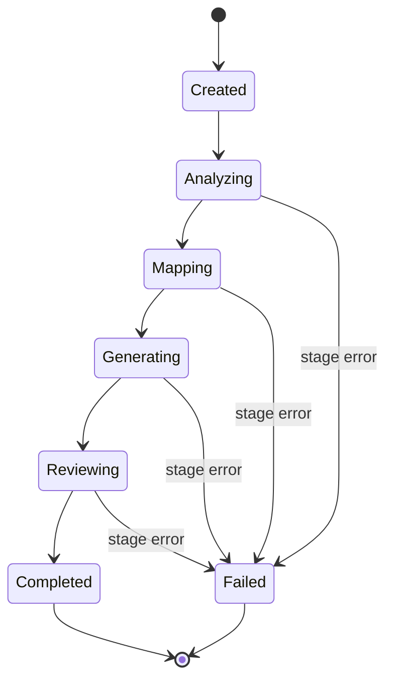
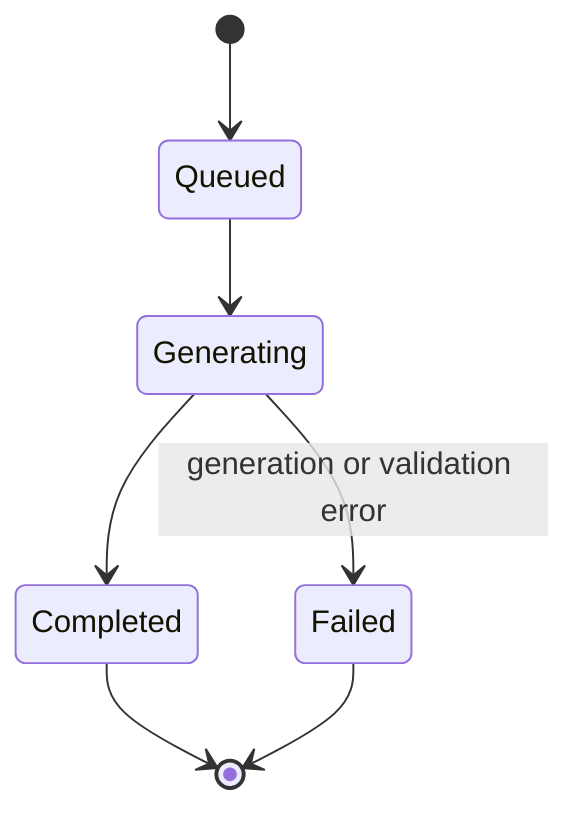

# API Design

Status: Draft · Date: 2026-07-07 · Version: 0.1
Vision deliverable: 9 (API Design)

## Summary

The API is REST over HTTPS, JSON payloads serialized with Newtonsoft.Json.
Generation is asynchronous: creating a session returns `202 Accepted` with a
status URL; clients poll for stage progress and fetch results when the session
reaches a terminal state. A debug knowledge endpoint exists for inspection only;
AI stages never use it.

## Conventions

- Base path: `/api/v1`.
- All responses are JSON, camelCase.
- Errors use RFC 7807 `ProblemDetails` with a correlation id.
- Long-running work returns `202 Accepted` with a `Location` header.
- Authentication: Entra ID bearer token (future). See `04-cross-cutting/04-security.md`.

## Endpoints

| Method | Path | Purpose | Request body | Success response |
|---|---|---|---|---|
| POST | `/prototypes` | Upload HTML and CSS. | `{ html, css }` | `201` `Prototype` |
| POST | `/prototypes/generate` | Generate a DS-conformant prototype from intent (ADR-006, async). | `PrototypeRequest` | `202` `{ prototypeId }`, `Location: /prototypes/{id}` |
| GET | `/prototypes/{id}` | Fetch a prototype (including a generated one); poll an async generate job. | none | `200` `Prototype` |
| GET | `/prototypes/{id}/conformance` | Get the prototype conformance report (advisory, ADR-005). | none | `200` `PrototypeConformanceReport` |
| POST | `/sessions` | Start a generation session. | `{ prototypeId }` | `202` `{ sessionId }`, `Location: /sessions/{id}` |
| GET | `/sessions/{id}` | Get session status and stage states. | none | `200` `GenerationSession` |
| GET | `/sessions/{id}/analysis` | Get prototype analysis. | none | `200` `PrototypeAnalysis` |
| GET | `/sessions/{id}/mappings` | Get component mappings. | none | `200` `ComponentMapping[]` |
| GET | `/sessions/{id}/intermediate-ui` | Get the intermediate UI tree. | none | `200` `IntermediateUiTree` |
| GET | `/sessions/{id}/artifacts` | Get generated files. | none | `200` `GeneratedArtifact[]` |
| GET | `/sessions/{id}/review` | Get the review report. | none | `200` `ReviewReport` |
| GET | `/prompts/{key}/versions` | List prompt versions for a key. | none | `200` `PromptVersion[]` |
| GET | `/debug/knowledge/components` | Inspect knowledge (not for AI). | query params | `200` `ComponentSummary[]` |
| GET | `/health` | Liveness probe. | none | `200` `{ status }` |

## Session lifecycle

A session moves through stages. The `GET /sessions/{id}` response includes the
current stage and per-stage status so clients can show progress.



## Prototype generation lifecycle

`POST /prototypes/generate` (ADR-006) is its own async job, separate from a
generation session. It returns `202` with `Location: /prototypes/{id}`; clients
poll `GET /prototypes/{id}` until the generated prototype is available.



A completed generation produces a DS-conformant `Prototype` by construction. To
convert it to React, the client starts a generation session with
`POST /sessions` referencing the generated `prototypeId`. The prototype
conformance report (`GET /prototypes/{id}/conformance`, ADR-005) is advisory for
uploaded prototypes and a sanity check for generated ones.

## Request and response examples

Create session:

```http
POST /api/v1/sessions
Content-Type: application/json

{ "prototypeId": "p-001" }
```

```http
HTTP/1.1 202 Accepted
Location: /api/v1/sessions/s-1234

{ "sessionId": "s-1234" }
```

Poll status:

```http
GET /api/v1/sessions/s-1234
```

```json
{
  "sessionId": "s-1234",
  "prototypeId": "p-001",
  "status": "Generating",
  "stages": [
    { "name": "Analyze", "status": "Completed" },
    { "name": "Map", "status": "Completed" },
    { "name": "Generate", "status": "Running" },
    { "name": "Review", "status": "Pending" }
  ]
}
```

## Async pattern

Polling is the MVP mechanism. An optional SignalR hub (`/hubs/sessions/{id}`)
may stream stage events in a later phase for real-time updates. Polling clients
should back off (for example, two seconds) between calls.

## Schema references

- `PrototypeAnalysis`: `01-schemas-contracts` (domain model and database design).
- `PrototypeRequest` and generated `Prototype`: see
  `02-ai-modules/06-prototype-generation-strategy.md` (ADR-006).
- `PrototypeConformanceReport`: see `02-ai-modules/05-ai-review-strategy.md` (ADR-005).
- `ComponentMapping[]`: see `02-ai-modules/03-component-mapping-strategy.md`.
- `IntermediateUiTree`: `01-schemas-contracts/02-intermediate-ui-schema.md`.
- `GeneratedArtifact[]` and `ReviewReport`: see the domain model and
  `02-ai-modules/05-ai-review-strategy.md`.

## What is not shown

- Storage layout for these resources: see `01-schemas-contracts/05-database-design.md`.
- Auth and rate limiting: see `04-cross-cutting/04-security.md`.
