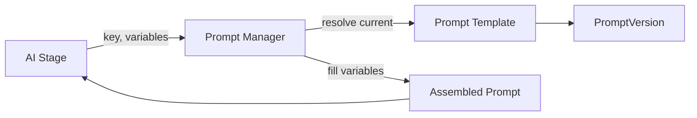

# Prompt Versioning

Status: Draft · Date: 2026-07-07 · Version: 0.1
Vision deliverable: 15 (Prompt Versioning)

## Summary

The Prompt Version Manager stores immutable, semver-tagged prompt versions and
resolves the active version per template key. Versions record the provider and
model they were evaluated against and their evaluation scores, so changes are
traceable and rollback is safe. AI stages never load prompts directly; they call
the Prompt Manager.

## Versioning model

- A `PromptTemplate` has a `key` and a `currentVersion` pointer.
- A `PromptVersion` is immutable once published. Editing a prompt creates a new
  version.
- Versions use semantic versioning: `MAJOR.MINOR.PATCH`.
  - `PATCH`: wording fixes that do not change the output contract.
  - `MINOR`: additive changes (a new variable, a new few-shot example).
  - `MAJOR`: output contract change or a behavior change that requires
    re-evaluation.
- Each version records: `key`, `version`, `systemMessage`, `variables`,
  `outputContract`, `examples`, `provider`, `model`, `evalScores`, `createdAt`,
  `author`.

## Storage

Two Cosmos containers (see `01-schemas-contracts/05-database-design.md`):

- `prompts`: one document per key, holding metadata and `currentVersion`.
- `promptVersions`: one document per immutable version, partitioned by `key`.

Publishing writes a new document to `promptVersions` and updates `currentVersion`
in `prompts`. Existing version documents are never mutated.

## Evaluation

A new version is not promoted to `currentVersion` until it passes the prompt
evaluation harness (`Aife.PromptEval`). The harness runs the version against a
scored dataset and records:

- Accuracy against expected output (for the analyzer and mapper).
- Compliance rate (for the generator and reviewer).
- Token cost and latency.

Scores are stored on the version. A version below the threshold stays unpublished.

## Rollback and A/B

- Rollback sets `currentVersion` to a prior published version. Because versions
  are immutable, this is a pointer change with no data loss.
- A/B testing routes a percentage of stage calls to a candidate version by
  selecting the version in the Prompt Manager based on a session attribute. The
  selected version is recorded on the stage output for later comparison.

## Resolution flow

## What is not shown

- Template content: see `02-ai-modules/01-prompt-templates.md`.
- Evaluation harness design: see `04-cross-cutting/05-testing-strategy.md`.
