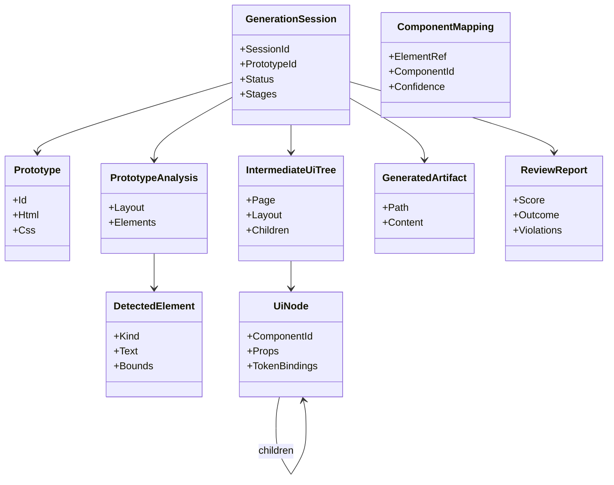
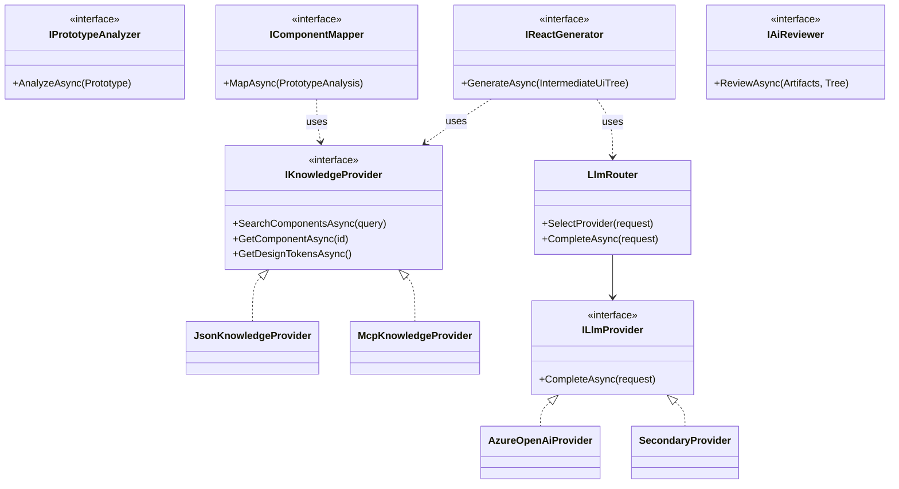

# Class Diagrams

Status: Draft · Date: 2026-07-07 · Version: 0.1
Vision deliverable: 21 (Class Diagrams)

## Summary

Class diagrams for each bounded context, consistent with the domain model and the
architecture documents. Diagrams stay under roughly 15 elements each and use one
diagram per question. Naming matches the ubiquitous language in
`00-foundation/04-domain-model.md`.

## Generation domain

Audience: developers. Shows the entities a generation session produces and
references.

## Abstractions and implementations

Audience: developers. Shows the interfaces in `Aife.Application` and their
implementations, and the boundary that keeps AI code decoupled from sources and
providers.

## What is not shown

- Domain invariants and value object detail: see `00-foundation/04-domain-model.md`.
- Request sequences between these classes: see `03-diagrams/02-sequence-diagrams.md`.
