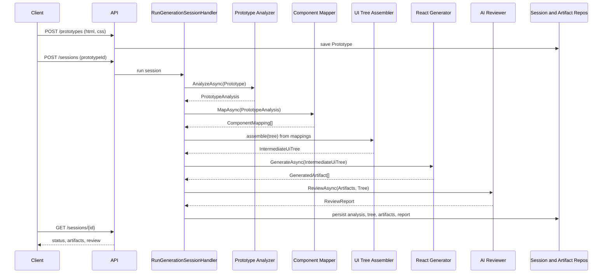
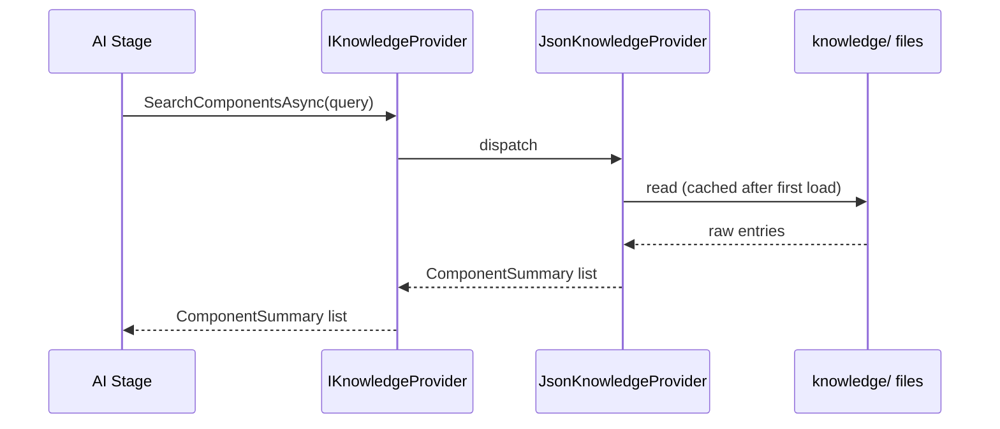
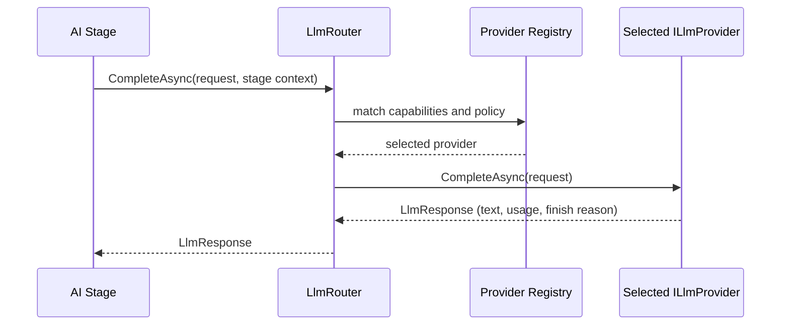
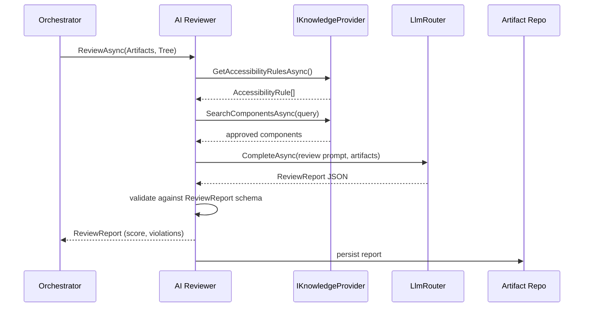
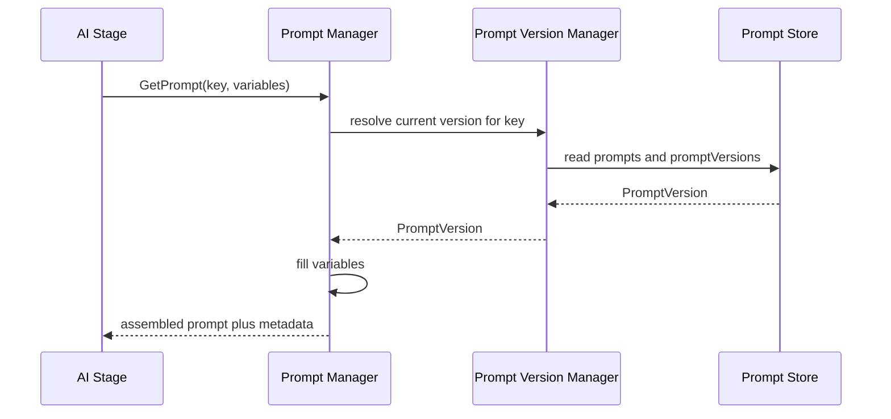

# Sequence Diagrams

Status: Draft · Date: 2026-07-07 · Version: 0.1
Vision deliverable: 22 (Sequence Diagrams)

## Summary

Five sequence diagrams covering the flows that matter most: the full pipeline, a
knowledge lookup, LLM Router provider selection, the AI Review flow, and prompt
version resolution. Diagram names reference every stage and schema by name to
support pipeline traceability.

## Full pipeline

Audience: developers. Shows one generation session end to end, from prototype
upload to production React plus review report.

## Knowledge lookup

Audience: developers. Shows an AI stage querying knowledge through
`IKnowledgeProvider`, never reading files directly.

## LLM Router provider selection

Audience: developers. Shows the router choosing a provider by capability and
policy, then calling it.

## AI Review flow

Audience: developers. Shows the reviewer gathering rules and approved components
before scoring.

## Prompt version resolution

Audience: developers. Shows the Prompt Manager resolving the active version and
filling variables before a stage calls the router.

## What is not shown

- Class structure behind these participants: see `03-diagrams/01-class-diagrams.md`.
- API endpoint details: see `01-schemas-contracts/04-api-design.md`.
