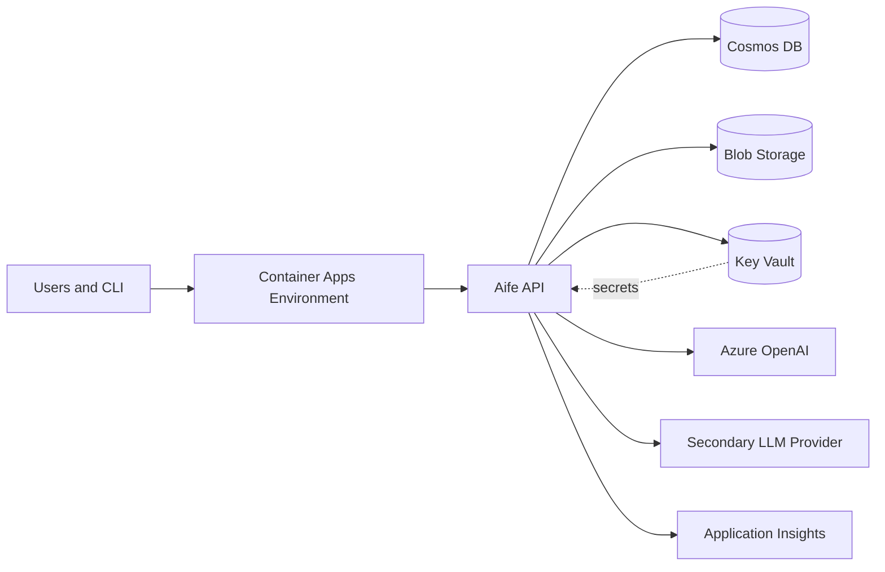

# Deployment Architecture

Status: Draft · Date: 2026-07-07 · Version: 0.1
Vision deliverable: 23 (Deployment Architecture)

## Summary

The platform runs on Azure. The API is a containerized service on Azure Container
Apps, stateless and horizontally scalable. Cosmos DB stores sessions, artifacts,
prompts, and cache. Blob Storage holds large generated files. Key Vault holds
secrets. Azure OpenAI provides the default LLM; a secondary provider is called
over the internet. Application Insights collects logs, traces, and metrics.

## Topology

## Components

| Component | Service | Purpose |
|---|---|---|
| API host | Azure Container Apps | Runs `Aife.Api` and `Aife.Cli` jobs. Stateless. |
| Datastore | Azure Cosmos DB | Sessions, artifacts, prompts, promptVersions, knowledgeCache. |
| Object storage | Azure Blob Storage | Large generated artifacts. |
| Secrets | Azure Key Vault | LLM keys, Cosmos keys, connection strings. |
| Default LLM | Azure OpenAI | Analyzer, generator, reviewer. |
| Secondary LLM | External provider | Mapper, long-context review. |
| Observability | Application Insights and OpenTelemetry | Logs, traces, metrics. |

## Environments

Three environments: `dev`, `stage`, `prod`. Each has its own resource group,
Cosmos account, Key Vault, and Azure OpenAI deployment. Dev and stage use lower
RU and smaller SKUs. Secrets are environment-scoped and never shared.

## Resilience

- The API is stateless, so instances can be added or removed without session
  loss. Session state lives in Cosmos.
- Azure OpenAI calls use provisioned or shared throughput with retry and circuit
  breaker policies (Polly).
- Cosmos DB uses multi-region writes only if required by adoption; single-region
  with zone redundancy is the MVP baseline.

## What is not shown

- Cost and RU tuning: see `04-cross-cutting/06-scalability-strategy.md`.
- Deployment pipeline: see `04-cross-cutting/03-cicd-strategy.md`.
- Security controls: see `04-cross-cutting/04-security.md`.
