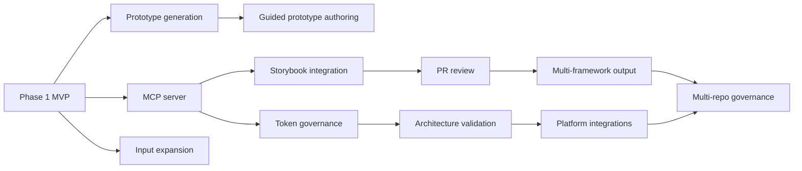

# Future Roadmap

Status: Approved · Date: 2026-07-07 · Version: 1.0
Vision deliverable: 30 (Future Roadmap)

## Summary

The vision defines Phases 2 through 5. This document refines them into
milestones mapped to the extension points in `04-cross-cutting/07-extension-strategy.md`.
Each milestone is sized so it can be planned into sprints. Dates are not committed
here; they are set during sprint planning. The Phase 1 MVP baseline includes the
advisory Prototype Conformance Review (ADR-005). Phase 1.5 adds the Prototype
Generator (ADR-006): intent → DS-conformant prototype, correct at once, no
back-and-forth for non-technical authors. The milestones below extend the
platform from that baseline.

## Milestone map

| Phase | Milestone | Capabilities | Extension points used |
|---|---|---|---|
| Phase 1.5 | Prototype generation from intent | Generate a DS-conformant prototype from a PO's intent; conformant by construction, no back-and-forth (ADR-006). | Prototype Generator, Knowledge Provider. |
| Phase 2 | MCP server | Expose Knowledge Base as MCP tools; add `McpKnowledgeProvider`. | `IKnowledgeProvider`. |
| Phase 2 | Input expansion | Figma JSON and image input. | Prototype ingestion. |
| Phase 2 | Guided prototype authoring | Visual authoring from DS component blocks plus blocking conformance gates; complements intent-based generation (ADR-006) with an interactive surface. | Prototype ingestion, Prototype Conformance Reviewer, Knowledge Base. |
| Phase 3 | Storybook integration | Read live Storybook stories as knowledge. | `IKnowledgeProvider`. |
| Phase 3 | Token governance | Design token validation and drift detection. | Review rules, Knowledge Base. |
| Phase 4 | PR review | Automatic PR reviews on generated code. | `IAiReviewer`, repository integration. |
| Phase 4 | Architecture validation | Validate generated app structure against standards. | Review rules. |
| Phase 4 | Documentation generation | Generate component and page docs from artifacts. | `IReactGenerator` peer. |
| Phase 5 | Multi-framework output | Angular and Vue generators. | `IReactGenerator` peer. |
| Phase 5 | Platform integrations | GitHub, Azure DevOps, Jira, Wiki. | New platform modules. |
| Phase 5 | Multi-repository governance | Govern Design System use across repos. | Knowledge Base, review rules. |

## Dependencies between milestones

## Guiding principles for the roadmap

- Each milestone preserves the abstraction boundaries. No milestone lets AI code
  read sources directly or call a provider without the router.
- Knowledge stays data where possible. New rules and DS content do not require
  code releases.
- Prompts stay versioned. New models or providers are validated against prompt
  versions before promotion.

## What is not shown

- Phase 1 MVP design: see the foundation and AI module documents.
- Extension point detail: see `04-cross-cutting/07-extension-strategy.md`.
